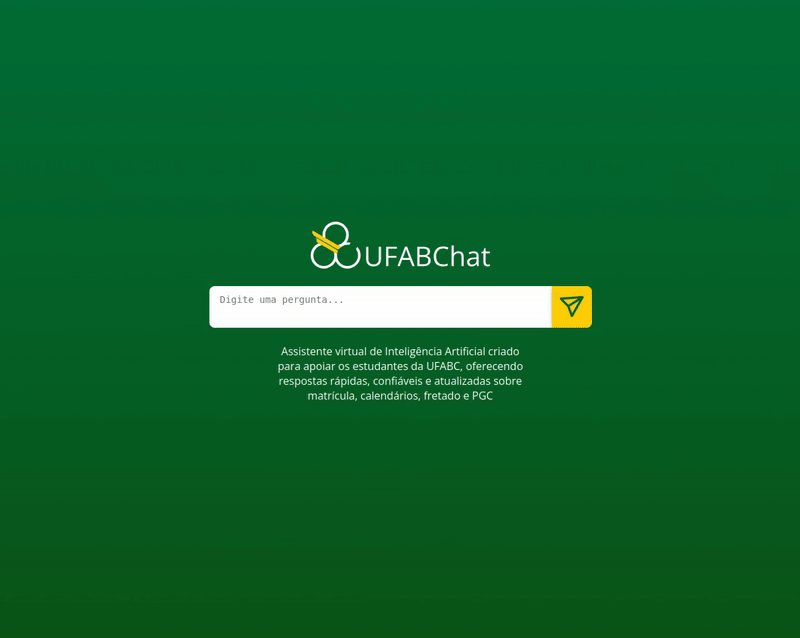

# Chatbot Assistente UFABC (RAG)

Chatbot para a UFABC baseado em **Retrieval-Augmented Generation (RAG)**. Ele busca trechos em documentos institucionais (PDFs, tabelas e imagens), sumariza e usa um LLM para responder com contexto.

**Acesse o projeto:** https://ufabc-chat.vercel.app/



## Principais features

- **RAG multimodal**: texto, tabelas (HTML) e imagens (sumarizadas na indexação)
- **Persistência**: vetores em **Chroma** e **docstore** em disco (LocalFileStore)
- **Reidratação inteligente**: se o docstore sumir, ele é reconstruído **sem re-embedar**
- **API FastAPI** (concorrência pronta) + **CLI** (modo terminal)
- **Ollama** para embeddings locais (fallbacks de LLM: Groq/OpenAI, se configurados)
- **Classificação robusta** em `parse_docs` (evita confundir texto com base64)

## Estrutura do projeto

```
rag_pipeline/
├── __init__.py
├── api.py                     # FastAPI (serviço)
├── main.py                    # CLI (terminal)
├── config.py                  # Paths absolutos e configs
├── core/
│   ├── models.py              # get_llama_model / get_llava_model
│   ├── prompt_utils.py        # parse_docs, build_prompt etc.
│   └── retriever_pipeline.py  # get_rag_pipeline (Opção B com reidratação)
├── data/
│   ├── pdf_utils.py           # extração (unstructured) e classificação
│   ├── summarization.py       # sumarização + add_documents (vectorstore + docstore)
│   └── retry.py               # retry_with_backoff
├── utils/
│   ├── display_utils.py       # helper p/ exibir imagens base64 (CLI)
│   └── ...
└── .cache_chunks/             # gerado em runtime (chroma_store, summaries, chunks)
```

## Requisitos

- Python **3.10+**
- [Ollama](https://ollama.com/download) (para embeddings locais)
- (Opcional) chaves **OpenAI** / **Groq** para fallback do LLM

### Instalação e execução do back-end python

0. **Entre na past back-end**:
   ```bash
   cd back-end
   ```

1. **Configure o ambiente Python**:
   ```bash
   python -m venv .venv
   source .venv/bin/activate     # Linux/macOS
   # .venv\Scripts\activate      # Windows
   
   cd back-end

   pip install -r requirements.txt
   ```

2. **Configure as variáveis de ambiente**:
   ```bash
   cp .env.example .env
   # Edite o arquivo .env com suas chaves de API
   ```

3. **Verifique se o Ollama está rodando**:
   ```bash
   ollama serve
   ```

4. **Se for usar modelos locais, instale os modelos**:
   ```bash
   ollama pull llama3.2:latest
   ollama pull nomic-embed-text:latest
   ```

5. **Rode a aplicação** (escolha uma das opções):

   ### **API FastAPI** (Servidor Web)
   
   **Opção 1 - Como módulo (Recomendado):**
   ```bash
   cd src
   python3 -m rag_pipeline.api
   ```
   
   **Opção 2 - Do diretório back-end:**
   ```bash
   # A partir do diretório back-end
   python3 -m src.rag_pipeline.api
   ```
   
   **Opção 3 - Com PYTHONPATH:**
   ```bash
   PYTHONPATH=src python3 src/rag_pipeline/api.py
   ```

   ### **CLI (Terminal Interativo)**
   
   **Opção 1 - Como módulo (Recomendado):**
   ```bash
   cd src
   python3 -m rag_pipeline.main
   ```
   
   **Opção 2 - Do diretório back-end:**
   ```bash
   # A partir do diretório back-end
   python3 -m src.rag_pipeline.main
   ```
   
   **Opção 3 - Com PYTHONPATH:**
   ```bash
   PYTHONPATH=src python3 src/rag_pipeline/main.py
   ```

   ### **Diferenças entre API e CLI:**
   
   - **API (api.py)**: 
     - Servidor web FastAPI rodando na porta 8000
     - Aceita requisições HTTP (POST /ask, POST /chat, GET /health)
     - Ideal para integração com front-end ou outras aplicações
     - Carrega o modelo uma vez e reutiliza entre requisições
   
   - **CLI (main.py)**:
     - Interface de terminal interativa
     - Permite fazer perguntas diretamente no terminal
     - Ideal para testes rápidos e desenvolvimento
     - Pergunta se deve regenerar os chunks na inicialização
     - Digite 'sair' para encerrar a sessão

   ### **Exemplo de uso do CLI:**
   ```bash
   cd src
   python3 -m rag_pipeline.main
   
   # Saída esperada:
   # Deseja gerar os chunks novamente? (s/n): n
   # Usando cache de chunks existente...
   # Pergunta (ou 'sair'): O que é o PGC?
   # [Resposta do modelo]
   # Pergunta (ou 'sair'): sair
   ```

> **Importante**: Use uma das opções acima para evitar erros de import relativo. Não execute diretamente `python3 src/rag_pipeline/api.py` pois isso causará `ImportError: attempted relative import with no known parent package`.

> **Nota**: Se o `unstructured.partition.pdf` pedir extras (OCR), instale variantes como `unstructured[all-docs]`.

## Configuração de Variáveis de Ambiente

### Setup para Desenvolvimento

1. **Copie o arquivo de exemplo**:
   ```bash
   cp .env.example .env
   ```

2. **Edite o arquivo `.env`** com suas chaves reais:
   ```bash
   # API Keys obrigatórias
   GROQ_API_KEY=sua_chave_groq_aqui
   OPENAI_API_KEY=sua_chave_openai_aqui
   
   # Base URL do Ollama (padrão: localhost)
   OLLAMA_BASE_URL=http://localhost:11434
   
   # Provedor de modelo para geração de texto (padrão: ollama)
   # Opções: ollama, openai, groq
   MODEL_PROVIDER=ollama
   
   # Provedor de embeddings (padrão: ollama)
   # Opções: ollama, nomic
   EMBEDDINGS_PROVIDER=ollama
   
   # Chave da API Nomic (necessária apenas se EMBEDDINGS_PROVIDER=nomic)
   NOMIC_KEY=sua_chave_nomic_aqui
   ```

### Obtendo as API Keys

- **Groq**: Registre-se em [console.groq.com](https://console.groq.com) para obter sua chave gratuita
- **OpenAI**: Acesse [platform.openai.com/api-keys](https://platform.openai.com/api-keys) para gerar uma API key
- **Nomic**: Registre-se em [atlas.nomic.ai](https://atlas.nomic.ai) para obter sua chave de API (necessária apenas se usar `EMBEDDINGS_PROVIDER=nomic`)

### Configuração para Produção/Servidor

Em ambiente de produção, defina as variáveis de ambiente diretamente no sistema:

```bash
# Linux/macOS
export GROQ_API_KEY="sua_chave_groq"
export OPENAI_API_KEY="sua_chave_openai"
export OLLAMA_BASE_URL="http://seu-servidor-ollama:11434"
export MODEL_PROVIDER="ollama"
export EMBEDDINGS_PROVIDER="ollama"
export NOMIC_KEY="sua_chave_nomic"

# Windows
set GROQ_API_KEY=sua_chave_groq
set OPENAI_API_KEY=sua_chave_openai
set OLLAMA_BASE_URL=http://seu-servidor-ollama:11434
set MODEL_PROVIDER=ollama
set EMBEDDINGS_PROVIDER=ollama
set NOMIC_KEY=sua_chave_nomic
```

### Validação das Variáveis

O sistema valida automaticamente se todas as variáveis obrigatórias estão configuradas:
- `GROQ_API_KEY`
- `OPENAI_API_KEY` 
- `OLLAMA_BASE_URL`
- `MODEL_PROVIDER` (opcional, padrão: "ollama")
- `EMBEDDINGS_PROVIDER` (opcional, padrão: "ollama")
- `NOMIC_KEY` (obrigatória apenas se `EMBEDDINGS_PROVIDER=nomic`)

Se alguma variável estiver faltando, você verá um erro como:
```
ValueError: Missing required environment variables: GROQ_API_KEY, OLLAMA_BASE_URL
```

### Configuração de Provedores

#### Provedores de Modelos de Texto (MODEL_PROVIDER)
- **ollama** (padrão): Usa modelo local `llama3.1:8b`
- **openai**: Usa `gpt-4o-mini` da OpenAI
- **groq**: Usa `llama-3.1-8b-instant` da Groq

#### Provedores de Embeddings (EMBEDDINGS_PROVIDER)
- **ollama** (padrão): Usa modelo local `nomic-embed-text` via Ollama
- **nomic**: Usa API Nomic `nomic-embed-text-v1.5` (requer `NOMIC_KEY`)

**Vantagens de usar Nomic API para embeddings:**
- Não requer instalação local do modelo
- Embeddings otimizados e mais rápidos
- Ideal para ambientes serverless (AWS Lambda, etc.)
- Melhor performance em produção

## Baixar os modelos no Ollama

Certifique-se de que o Ollama está rodando (ollama serve) e então baixe os modelos usados pelo projeto:
```bash
# LLM para geração de respostas
ollama pull llama3.1:8b

# LLM multimodal para sumarizar imagens na indexação
ollama pull llava:13b

# Modelo de embeddings (texto)
ollama pull nomic-embed-text

# Certifica que os modelos estão instalados
ollama list
```

No **Windows**, para expor o Ollama para a rede/WSL:

```powershell
$env:OLLAMA_HOST="0.0.0.0:11434"
$env:OLLAMA_ORIGINS="*"
ollama serve
# libere a porta 11434 no Firewall do Windows
```


Como fazer perguntas:

Pergunta unica:
```
curl --request POST \
  --url http://127.0.0.1:8000/ask \
  --header 'Content-Type: application/json' \
  --header 'User-Agent: insomnia/11.5.0' \
  --data '{
	"question": "quantas vezes posso trancar a matricula?"
}'
```

Modo Chat:
```
curl --request POST \
  --url http://127.0.0.1:8000/chat \
  --header 'Content-Type: application/json' \
  --header 'User-Agent: insomnia/11.5.0' \
  --data '{
	"messages": [
	{"role": "user", "content": "Me explique brevemente sobre a matricula"},	
			{"role": "system", "content": "Olá!"},
{"role": "user", "content": "Olá"}
	]
}'
```

## Configuração de paths

Os paths são absolutos (via `Path.resolve()`) a partir da raiz do repositório:

- PDFs: `data_extraction/documentos_ufabc/Prograd`
- Cache de chunks: `.cache_chunks/chunks_classificados.json`
- Cache de summaries: `.cache_chunks/summaries.json`
- Vetores/Chroma + docstore: `.cache_chunks/chroma_store/`


docker build --platform linux/amd64 -t aws_rag_app .

# Option 1: Use host network (recommended for full host access on Linux)
docker run --rm --network host \
--entrypoint python \
--env-file .env \
aws_rag_app rag_pipeline/api.py

# Option 2: Use bridge mode with host gateway (for macOS/Windows or port mapping)
docker run --rm -p 8000:8000 \
--add-host=host.docker.internal:host-gateway \
--entrypoint python \
--env-file .env \
aws_rag_app rag_pipeline/api.py

## Deploy para AWS Lambda (CDK)

### Pré-requisitos

1. **AWS CLI configurado**:
   ```bash
   aws configure
   # Insira suas credenciais AWS (Access Key ID, Secret Access Key, região)
   ```

2. **AWS CDK instalado**:
   ```bash
   npm install -g aws-cdk
   ```

3. **Node.js** (versão 18+) instalado

### Deploy

1. **Entre no diretório CDK**:
   ```bash
   cd rag-cdk-infra
   ```

2. **Instale as dependências**:
   ```bash
   npm install
   ```

3. **Configure o Bootstrap CDK** (apenas na primeira vez):
   ```bash
   cdk bootstrap
   ```

4. **Configure as variáveis de ambiente**:
   Certifique-se de que o arquivo `back-end/.env` contém todas as variáveis necessárias, incluindo:
   ```bash
   API_KEY=your_secure_api_key_here
   GROQ_API_KEY=your_groq_api_key
   NOMIC_KEY=your_nomic_key
   # ... outras variáveis
   ```
   
   > **Importante**: O CDK lê o `API_KEY` do arquivo `back-end/.env` para configurar a autenticação do API Gateway.

5. **Deploy da aplicação**:
   ```bash
   cdk deploy
   ```

6. **Após o deploy**, você receberá as seguintes saídas:
   ```
   RagCdkInfraStack
   Outputs:
   RagCdkInfraStack.ApiGatewayUrl = https://quhv2plta1.execute-api.sa-east-1.amazonaws.com/prod/
   RagCdkInfraStack.ApiKeyId = xxxxxxxxxxxxx
   ```
   
   A URL do API Gateway será usada pelo frontend. O `ApiKeyId` é apenas referência; o valor real do API Key é o configurado no `.env`.

### Testando o Deploy

```bash
# Teste o endpoint de saúde (substitua YOUR_API_KEY pelo valor do back-end/.env)
curl -H "x-api-key: YOUR_API_KEY" \
  https://quhv2plta1.execute-api.sa-east-1.amazonaws.com/prod/health

# Teste uma pergunta
curl -X POST "https://quhv2plta1.execute-api.sa-east-1.amazonaws.com/prod/ask" \
  -H "Content-Type: application/json" \
  -H "x-api-key: YOUR_API_KEY" \
  -d '{"question": "O que é o PGC?"}'

# Teste o endpoint de chat
curl -X POST "https://quhv2plta1.execute-api.sa-east-1.amazonaws.com/prod/chat" \
  -H "Content-Type: application/json" \
  -H "x-api-key: YOUR_API_KEY" \
  -d '{"messages": [{"role": "user", "content": "O que é o PGC?"}]}'
```

> **Nota**: Todas as requisições ao API Gateway requerem o header `x-api-key` com o valor configurado no arquivo `back-end/.env`. Requisições sem API Key válido receberão erro 403 Forbidden.

### Configuração do Ambiente

O CDK carrega automaticamente as variáveis de ambiente do arquivo `back-end/.env`. Certifique-se de que todas as variáveis necessárias estão configuradas:

- `API_KEY` (obrigatória) - Chave de autenticação para API Gateway
- `GROQ_API_KEY` (obrigatória)
- `OPENAI_API_KEY` (opcional)
- `NOMIC_KEY` (obrigatória se usando embeddings Nomic)
- `MODEL_PROVIDER` (padrão: groq)
- `EMBEDDINGS_PROVIDER` (padrão: nomic)

### Configuração do Frontend

O frontend Next.js precisa conhecer a URL do API Gateway e o API Key:

1. **Crie um arquivo `.env.local`** no diretório `front-end/`:
   ```bash
   BACKEND_URL=https://quhv2plta1.execute-api.sa-east-1.amazonaws.com/prod
   BACKEND_API_KEY=your_api_key_from_backend_env
   ```

2. **Use o mesmo API Key** configurado no arquivo `back-end/.env`

3. **Reinicie o servidor Next.js** após alterar variáveis de ambiente:
   ```bash
   cd front-end
   npm run dev
   ```

> **Segurança**: O API Key é usado apenas no servidor Next.js (API Route), nunca é exposto ao navegador do cliente.

## Verificando Logs do Lambda

### Método Rápido (Script Automatizado)

Use o script fornecido no diretório CDK:

```bash
cd rag-cdk-infra
./check-logs.sh
```

### Método Manual (AWS CLI)

1. **Listar os log streams mais recentes**:
   ```bash
   aws logs describe-log-streams \
     --log-group-name "/aws/lambda/RagCdkInfraStack-ApiFunc9527395A-CbVbFfQfMSzf" \
     --order-by LastEventTime --descending --max-items 3
   ```

2. **Obter logs de um stream específico**:
   ```bash
   # Substitua STREAM_NAME pelo nome obtido no comando anterior
   aws logs get-log-events \
     --log-group-name "/aws/lambda/RagCdkInfraStack-ApiFunc9527395A-CbVbFfQfMSzf" \
     --log-stream-name "STREAM_NAME" \
     --start-time $(date -d '10 minutes ago' +%s)000
   ```

### Logs em Tempo Real

Para monitorar logs em tempo real durante testes:

```bash
# Instalar ferramenta de streaming de logs (opcional)
npm install -g aws-logs-cli

# Stream logs em tempo real
aws-logs /aws/lambda/RagCdkInfraStack-ApiFunc9527395A-CbVbFfQfMSzf
```

### Limpeza

Para remover todos os recursos AWS criados:

```bash
cd rag-cdk-infra
cdk destroy
```
